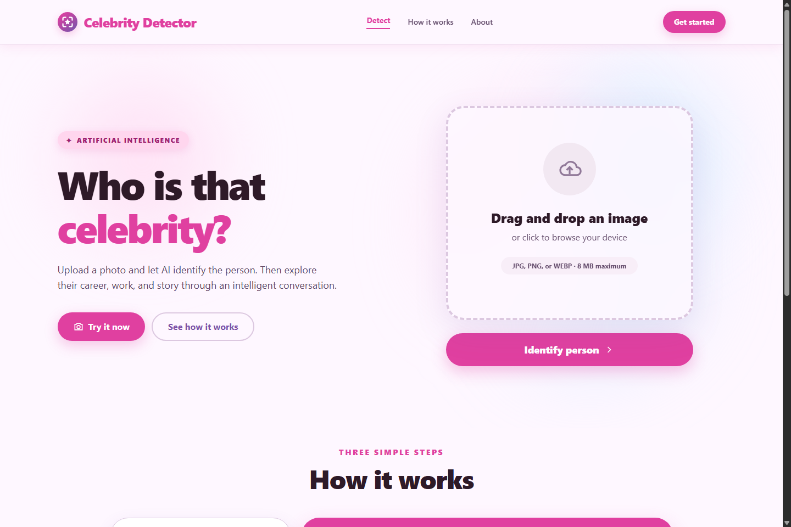
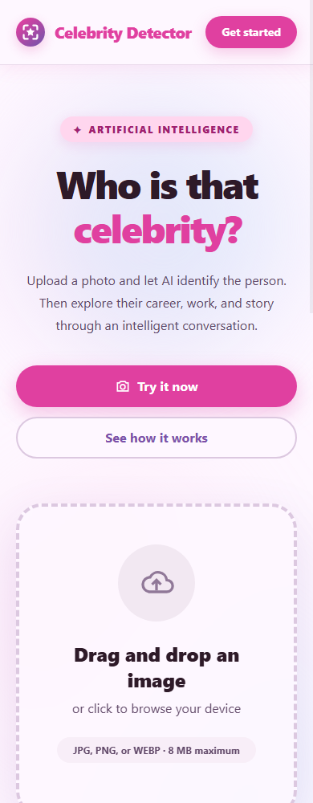
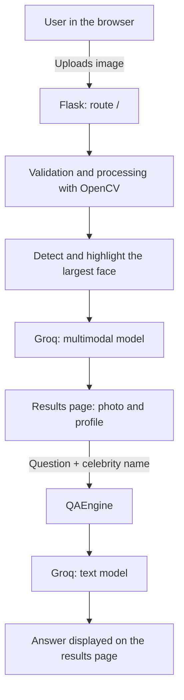
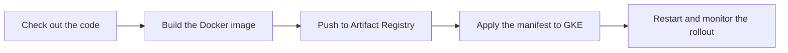

<div align="center">


# Celebrity Detector & Q&A

### One image. One discovery. Many questions.

Identify celebrities with computer vision and artificial intelligence, then ask questions about them through an interactive web interface.


[](https://www.youtube.com/watch?v=j0PUuiTYCAk)

[Video](#-project-video) · [Application](#-application) · [Features](#-features) · [Architecture](#-architecture) · [Local setup](#-local-setup) · [Deployment](#-docker-and-deployment)

</div>

---

## ✨ About the project

**Celebrity Detector & Q&A** brings image processing, AI models, and a Flask application together in a simple workflow: upload a photo, review the identification, and ask questions about the celebrity.

OpenCV detects the face and highlights its location in the image. A multimodal model accessed through the Groq API then attempts to identify the person and return information about their profession, nationality, and achievements. A second model answers questions submitted on the results page.

Developed as an educational project for the **LLMOps and AIOps Bootcamp**, this repository includes the web application, a Docker image definition, and deployment configuration for CircleCI, Google Artifact Registry, and Google Kubernetes Engine (GKE).

## 🎬 Project video

**[Watch the project video on YouTube →](https://www.youtube.com/watch?v=j0PUuiTYCAk)**

## 🖼️ Application

The interface uses pink, purple, and blue tones, a custom icon, rounded cards, and a responsive layout. Both the interface and this documentation are in English.

### Desktop

The home page introduces the project and provides an upload area to start the identification workflow.



### Mobile

On mobile, the content is arranged in a single column while keeping image upload accessible.

<p align="center">
  
</p>

> These screenshots show the actual application templates rendered locally in desktop and mobile viewports. They document the implemented interface; they do not show an API identification run or verify a cloud deployment.

### From photo to answer

1. **Upload an image:** click the upload area and select a photo from your device.
2. **Identify the person:** click **Identify person** to start processing.
3. **Review the result:** see the image with the face highlighted, along with the person's profession, nationality, what they are famous for, and top achievements.
4. **Explore with questions:** enter a question about the celebrity and click **Generate answer**.
5. **Start again:** use **New image** to analyze another photo.

## 🎯 Features

| Feature | Implementation |
| --- | --- |
| 📤 Image upload | Dedicated file selection area displaying the selected filename. |
| 🖼️ Validation | Accepts JPG, JPEG, PNG, and WEBP; validates image content with OpenCV. |
| 🔍 Face detection | A Haar Cascade locates faces and highlights the largest one with a rectangle. |
| ⭐ AI identification | Sends the processed image to a multimodal model through Groq. |
| 🪪 Celebrity profile | Displays name, profession, nationality, what the person is famous for, and achievements. |
| 💬 Questions and answers | Answers questions using the celebrity's name as context. |
| 📱 Responsive interface | Jinja2 templates, Tailwind CSS, and JavaScript for browser interactions. |
| 🛠️ Error handling | Messages for invalid files, missing faces, upload limits, and service failures. |
| 📦 Containerization | Dockerfile based on Python 3.12 slim. |
| 🚀 Automated delivery | CircleCI pipeline for building, publishing, and deploying the image to GKE. |

The server limits each request body to **8 MiB**, including form data. A file of exactly that size may exceed the limit once the form data is included.

## 🧠 Architecture



**OpenCV locates the face**; the **multimodal model** identifies the celebrity. The annotated image is converted to JPEG and sent to the API as Base64.

The current implementation has no database. Result data is passed through hidden form fields to preserve it between identification and question submission. Each question is an independent request, without accumulated conversation history.

### Technologies and responsibilities

| Layer | Technologies | Responsibility |
| --- | --- | --- |
| Interface | HTML, Jinja2, Tailwind CSS 4, JavaScript | Page rendering, uploads, and form interactions. |
| Backend | Python, Flask | Routes, forms, configuration, and error handling. |
| Computer vision | OpenCV, NumPy | Image decoding, face detection, and JPEG encoding. |
| AI | Groq API, Requests | Multimodal identification and answer generation. |
| Configuration | python-dotenv | Loading environment variables. |
| Infrastructure | Docker, Kubernetes, GKE | Packaging and running the application. |
| CI/CD | CircleCI, Artifact Registry | Building, publishing, and updating the image in the cluster. |

## 🚀 Local setup

### Prerequisites

- **Python 3.12**, the version used in the Dockerfile.
- A **Groq API key** with access to the configured models.
- **Node.js and npm** only if you need to rebuild the CSS. Compiled CSS is already included in the repository.

### 1. Set up the environment

From the project root, run the following in **PowerShell**. If a `.env` file already exists, skip the copy command and update only the variables you need.

```powershell
python -m venv venv
.\venv\Scripts\python.exe -m pip install -r requirements.txt
Copy-Item .env.example .env
```

<details>
<summary>Equivalent commands for Linux and macOS</summary>

```bash
python3 -m venv venv
./venv/bin/python -m pip install -r requirements.txt
cp .env.example .env
```

</details>

### 2. Configure environment variables

Edit the `.env` file:

```dotenv
GROQ_API_KEY=your_groq_api_key
GROQ_VISION_MODEL=qwen/qwen3.6-27b
GROQ_TEXT_MODEL=openai/gpt-oss-20b
SECRET_KEY=replace_with_a_random_value
FLASK_DEBUG=false
```

| Variable | Purpose |
| --- | --- |
| `GROQ_API_KEY` | Credential required for identification and questions. |
| `GROQ_VISION_MODEL` | Multimodal model; default in the code: `qwen/qwen3.6-27b`. |
| `GROQ_TEXT_MODEL` | Text model; default in the code: `openai/gpt-oss-20b`. |
| `SECRET_KEY` | Flask application secret key. Set your own value outside development. |
| `FLASK_DEBUG` | Enables debug mode when set to `true`. |

The model names above reflect the repository configuration. Execution depends on their availability in your Groq account and compatibility with the parameters used by the code.

The `.env.example` file enables debugging and does not include `SECRET_KEY`; the example above sets both explicitly. To generate a secret key locally:

```powershell
.\venv\Scripts\python.exe -c "import secrets; print(secrets.token_hex(32))"
```

### 3. Start the application

```powershell
.\venv\Scripts\python.exe run.py
```

On Linux/macOS, use `./venv/bin/python run.py`.

Open **http://localhost:5000**. The home page works without a Groq API key; identification and answers require a configured key.

### 4. Rebuild CSS after changing the interface

```powershell
npm ci
npm run build:css
```

To watch for changes during development:

```powershell
npm run dev:css
```

## 📦 Docker and deployment

### Run with Docker

With your `.env` configured, run:

```powershell
docker build -t celebrity-detector .
docker run --rm -p 5000:5000 --env-file .env -e FLASK_DEBUG=false celebrity-detector
```

The application will be available at **http://localhost:5000**.

### Delivery pipeline

The [`.circleci/config.yml`](.circleci/config.yml) file defines this sequence:



To use this configuration in your environment, set up a Google Cloud project, an Artifact Registry repository named `celebrity-detector-repo`, a GKE cluster, and a service account with the appropriate permissions. Configure the following variables in CircleCI:

| Variable | Expected value |
| --- | --- |
| `GCLOUD_SERVICE_KEY` | Service account JSON encoded in Base64. |
| `GOOGLE_PROJECT_ID` | Google Cloud project ID. |
| `GOOGLE_COMPUTE_REGION` | Region used by the registry and cluster. |
| `GKE_CLUSTER` | Kubernetes cluster name. |

In the [Kubernetes manifest](kubernetes-deployment.yaml), update `spec.template.spec.containers[0].image` to your project's image URI. The URI is currently hardcoded in the file and must match the image published by the pipeline.

The manifest also expects a Secret named `celebrity-detector-secrets`, containing the `GROQ_API_KEY` and `SECRET_KEY` keys, in the same namespace as the Deployment. It configures one replica and a `LoadBalancer` Service that forwards port 80 to container port 5000.

**Delivery scope:** infrastructure and automation files are versioned. The pipeline configuration does not include an automated test stage, and these local screenshots do not validate pipeline execution or the availability of a GKE environment. The current container starts Flask's development server; a production deployment requires an appropriate application server.

## 🗂️ Repository structure

```text
.
├── app/
│   ├── __init__.py               # Flask application factory and configuration
│   ├── routes.py                 # Upload, identification, and questions
│   └── utils/
│       ├── image_handler.py      # Validation, face detection, and JPEG encoding
│       ├── celebrity_detector.py # Multimodal model integration
│       └── qa_engine.py          # Text model integration
├── assets/css/tailwind-input.css  # Tailwind theme and input stylesheet
├── static/
│   ├── css/tailwind.css          # Compiled CSS
│   └── favicon.svg               # Application icon
├── templates/
│   ├── Home.html                 # Home page and upload
│   ├── Detection_results.html    # Profile, image, and questions
│   └── models/                   # Additional templates; unused by current routes
├── docs/images/                  # Screenshots used in this README
├── .circleci/config.yml          # Build and deployment pipeline
├── .env.example                  # Local configuration example
├── Dockerfile                    # Application packaging
├── kubernetes-deployment.yaml    # Deployment and Service
├── package.json                  # CSS build scripts
├── requirements.txt              # Python dependencies
├── setup.py                      # Package metadata and installation
└── run.py                        # Server entry point
```

## 💡 Current behavior and limitations

- Clear photos with a front-facing subject improve face detection. If there are multiple faces, the largest one is highlighted.
- AI may return an incorrect identification or fail to identify the person. The project does not implement its own confidence metric.
- Answers use the model's knowledge without web searches or a document knowledge base; recent information may be outdated.
- The processed image is sent to Groq for analysis. The application does not persist uploads to disk or a database.
- The question form allows up to 500 characters in the browser; the backend checks that the name and question are not empty.
- Local credentials, `.env`, and Google Cloud key files are covered by `.gitignore` rules.

## 👨‍💻 Author

**Eduardo dos Santos Sousa**

An educational project for practicing AI integration, computer vision, web development, and containerized application delivery.

---

<div align="center">
  
  <p><strong>Celebrity Detector & Q&A</strong><br>From image to discovery, through an interactive experience.</p>
</div>
